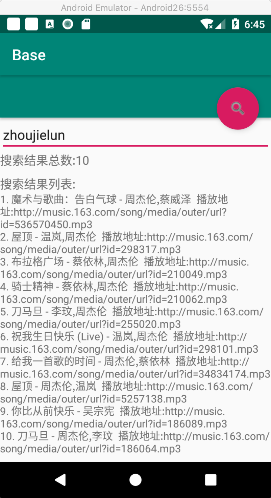

# android_mvvm_kotlin_dsl
## 淡化了LiveData、Lifecycle的存在，dsl style便于阅读

### 简单2步完成订阅和更新数据
#### View - 装载订阅
```kotlin
viewModel<XXViewModel> {
    attachObserve<String> {
        key {
            method = "setUserName"
        }
        observe {
            onChange {tv_user_name.text = "$this"} // 更新UI
        }
    }
    
    attachObserve<XX> {
        // ...
    }
}
```
#### ViewModel - 设置、更新数据（下一版使用kapt技术自动生成更新数据的方法，委托调用使用可以减少开发代码）
```kotlin
fun setUserName(name:String) {
    setValue<String> {
        key {
            method = "setUserName"
        }
        value { name }
    }

}
```

## API说明
### 一、装载订阅
#### 1.[LiveDataViewModel.attachObserve]常规无状态，使用参考上面的例子
#### 2.[LiveDataViewModel.attachEventObserve]异步场景有状态[EventValue.event]
#### 3.[LiveDataViewModel.attachEventObserveForArrayList]异步场景有状态

### 二、设置值
#### 1.[LiveDataViewModel.setValue]常规无状态，使用参考上面的例子
#### 2.[LiveDataViewModel.setEventValue]异步场景有状态，具体使用可参考[LiveDataViewModel.observeAndTransformEventObserver]
#### 3.[LiveDataViewModel.setEventValueForArrayList]异步场景ArrayList有状态，具体使用可参考[LiveDataViewModel.observeAndTransformEventObserverForArrayList]

### 三、获取值(参考设置值)
#### 1.[LiveDataViewModel.getValue]常规无状态
#### 2.[LiveDataViewModel.getEventValue]异步场景有状态
#### 3.[LiveDataViewModel.getEventValueForArrayList]异步场景ArrayList有状态
装载订阅(attachObserve)时生命周期的提供者默认值为创建ViewModel时的LifecycleOwner对象，详情请查看[FragmentActivity.viewModel]和[Fragment.viewModel]的拓展函数,以及[ILiveDataViewModel.attachObserve]等装载订阅函数，如果你需要为LiveData提供其他的LifecycleOwner，那么需要在装载订阅时覆盖掉默认值

```
viewModel<XXViewModel> {
    attachObserve {
        key {...}
        observe {
            owner = LifecycleOwner
        }
    }
}
```

## 例子
### 搜索音乐


#### 1.生成LiveData并订阅
```kotlin
// 1.attach的目的是在对应的ViewModel生成对应的LiveData对象
// 2.LiveData会缓存在ViewModel中(有唯一的Key绑定，Key的生成与kClass、method相关)
// 3.observe的目的是订阅
viewModel<MusicViewModel> {

    // 结果总数量
    attachObserve<Int> {
    
        key{
            method = "setTotalCount"
        }

        // 订阅，观察数据变动
        observe {
            owner = this@MusicActivity
            onChange {
                tv_total.text = "$this"
            }
        }
    }

    
    // 结果总数量
    attachObserve<String> {
    
        key{
            method = "setResultList"
        }

        // 订阅，观察数据变动
        observe {
            owner = this@MusicActivity
            onChange {
                tv_result.text = "$this"
            }
        }
    }

    
    // 搜索音乐
    attachEventObserveForArrayList<SearchMusic.Item> {
        
        // 订阅，观察网络请求状态和结果
        observe {
            owner = this@MainActivity
            onStart {}
            onCancel {}
            onSuccess {}
            onFailed {}
        }
        
    }

}
```

#### 2.点击按钮搜索音乐
```kotlin
// 搜索音乐
viewModel<MusicViewModel> {
    searchMusic(name)
}
```

### 需要实现的类
#### 1.编写Retrofit的Service接口
```kotlin
interface MusicApi {
    @GET("/searchMusic")
    fun searchMusic(@Query("name")name:String):Observable<CommonResponse<ArrayList<SearchMusic.Item>>>
}
```
#### 2.编写ViewModel
```kotlin
class MusicViewModel : LiveDataViewModel() {

    fun searchMusic(name: String) {
        // 请求服务器获取搜索结果
        musicService {
            
            api { searchMusic(name = name) }.thenCall {
                /**
                 * 网络请求的观察器转换成EventValue通知[MusicActivity.attachEventObserveForArrayList<SearchMusic.Item>]
                 * &&
                 * 在通知UI前观察数据（设置搜索结果总数和设置结果列表）
                 */
                observeAndTransformEventObserverForArrayList {
                    onSuccess {
                        // 设置搜索结果总数
                        this@MusicViewModel.setTotalCount(this)
                        // 设置结果列表
                        this@MusicViewModel.setResultList(this)
                    }

                }

            }
            
        }

    }

    
    // 设置搜索结果总数
    private fun setTotalCount(list: ArrayList<SearchMusic.Item>?) {
        // 更新数据，通知订阅的位置
        setValue<Int> {
            key{
                method = "setTotalCount"
            }
            value { list?.size }
        }

    }
    
    // 设置结果列表
    private fun setResultList(list: ArrayList<SearchMusic.Item>?) {
        var result = ""
        list?.apply {
            this.forEachIndexed { index, item ->
                result += "${index + 1}. ${item.title} - ${item.author}  播放地址:${item.url}\n"
            }
        }

        if (result.isEmpty()) result = "暂无结果"

        // 更新数据，通知订阅的位置
        setValue<String> {
            key{
                method = "setResultList"
            }
            value { result }
        }

    }
}
```
