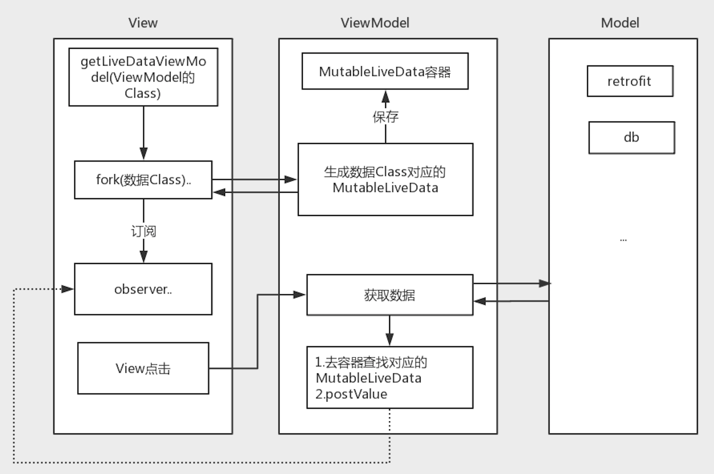

# mvvm_kolin



## 例子
### 搜索音乐
#### 1.创建ViewModel
```kotlin
val musicViewModel by lazy { getLiveDataViewModel<MusicViewModel>() }
```
    

#### 2.订阅
```kotlin
// fork的目的就是生成对应的MutableLiveData对象
musicViewModel.forkForArrayList(SearchMusic.Item::class.java)
    .observeSimple(
        owner = this,
        onSuccess = { result ->
            //成功
        }
     )
```

#### 3.view点击时获取数据
```kotlin
// 搜索音乐
musicViewModel.searchMusic(name)
```

### 需要实现的类
#### 1.编写Retrofit的Service接口
```kotlin
interface MusicApi {
    @GET("/searchMusic")
    fun searchMusic(@Query("name")name:String):Observable<CommonResponse<ArrayList<SearchMusic.Item>>>
}
```
#### 2.编写ViewModel
```kotlin
class MusicViewModel : AbsLiveDataViewModel() {

    fun searchMusic(name: String) {

        //1. 启动远端仓库
        launchRemoteRepo(MusicServiceCore) {
            // 2. 远端仓库的api请求
            searchMusic(name)
            //3. 提交远端仓库的api请求，当请求[开始、取消、成功、失败]会通知到View层订阅的地方
        }.commitForArrayList()
        
    }
}
```


## 其他例子
### 一次操作多次网络请求
#### 1.fork订阅
```kotlin
        /**
         * 申请借款
         */
        mLoanViewModel.fork(LoanApplyStart.Result::class)
                .observe(
                        owner = this,
                        onStart = {
                            showLoadingDialog(seqNo = 1)
                        },
                        onCancel = {
                            dialogDismiss(seqNo = 1)
                        },
                        onFailed = { _, _ ->
                            dialogDismiss(seqNo = 1)
                            false
                        },
                        onSuccess = { result ->
                            dialogDismiss(seqNo = 1)
                            result?.userState?.let { userState ->
                                loanApplyByUserState(userState)
                            }

                        }

                )
```
#### 2.viewModel中的嵌套请求
```kotlin
    /**
     * 申请借款
     */
    override fun loanApplyStart(days: Int) {
        val finalForkKClass = LoanApplyStart.Result::class // 和fork时的class一致
        val finalResult = LoanApplyStart.Result()

        // 1. 申请借款前置条件
        launchRemoteRepo(AppServiceCore) { loanApplyBefore(days) }
                .commitMulti(setStartAction = true, finalForkKClass = finalForkKClass) { result ->

                    // 2. 查询用户状态
                    launchRemoteRepo(AppServiceCore) { queryUserState() }
                            .commitMulti(setStartAction = false, finalForkKClass = finalForkKClass) { userState ->
                                finalResult.userState = userState
                                // 发送到observe订阅的onSuccess
                                setValue(finalForkKClass, EventAction.SUCCESS) {
                                    this.data = finalResult
                                }
                            
                            }


                }
    }

```
